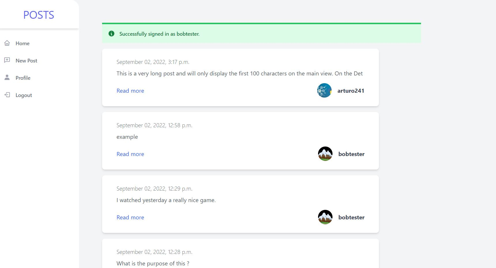
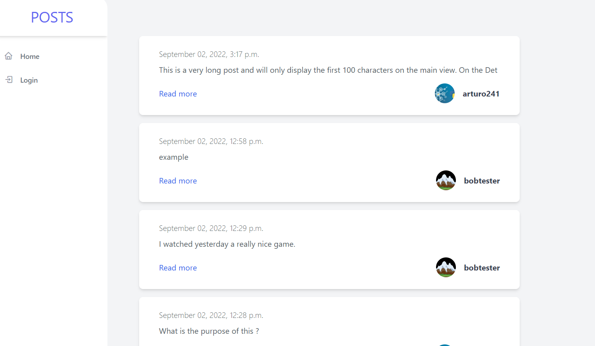

# POSTS_website

This is a responsive website that works like a blog where users can create accounts in order to post on the website, or if they are not signed in, they are limited to only viewing them. The authentication of users is implemented with the use of django-allauth.
The main page has a list of posts sorted in chronological order (starting from the most recent) and a left panel including all the possible options the current user has.
Signed-in users will have the option to:
1. Home - redirecting to main page.
2. New Post - posting, a new post.
3. Profile - redirecting to the profile view, where the user can change his username, email, first and last name, update the picture for the profile, and lastly, change the password.
4. Logout  - the user will be logged out.
whereas users who are signed out will have the option to: 
1. Home - redirecting to the main page
2. Login - redirecting to the login page where the user can either log in, create an account or reset the password (with an email token).

Additionally, each post as well as each user has a detailed view. The detailed post view displays the full text of the post (on the main page, post texts are limited to 100 characters), the date it was posted, and the author. The detailed user view will show the user's picture and the count of created posts and followers.

Logged-in users will have the option of following any user from the detail view. This will change the way the posts are displayed for them on the main page. The posts created by users who have been followed will always be displayed first. The users will also have the option to unfollow any other user at any time.

The buttons' Create Post and Un/Follow functionality is implemented using jQuery and JavaScript. Each time the user presses one of the buttons, an jQuery AJAX POST request is sent to the server and processed accordingly to its function.

On the main page, as well as on the edit profile view and change password view, the successful messages will be displayed at the top of the page. This is implemented using Django messages and will be visible only for one session.

All the media files are stored and managed by Django as static files. This solution needs to be adjusted in order to work in production.

 
Created with Django 4.1, sorl-thumbnail, django-allauth, django custom templates, Python 3.10.6, Tailwind CSS, JavaScript, jQuery with AJAX request, CSS, HTML. 
 

Django 4.1  
https://www.djangoproject.com/  

django custom templates 
https://docs.djangoproject.com/en/4.1/howto/custom-template-tags/ 

sorl-thumbnail  
https://github.com/jazzband/sorl-thumbnail  

django-allauth  
https://django-allauth.readthedocs.io/en/latest/overview.html  

Tailwind CSS  
https://tailwindcss.com/  
Some of the components that were used in this project:  
https://tailwindcomponents.com/component/sidebar-navigation  
https://tailwindcomponents.com/component/post-artical  
https://tailwindcomponents.com/component/buttons-with-icons  
https://tailwindcomponents.com/component/profile-card  

jQuery  
https://jquery.com/  

In order to run the program:  
1. Change the name of .env.example to .env and add your DJANGO_SECRET_KEY for your website.  
2. navigate to the main directory, which contains the entire project.  
3. python -m venv ENV - create a virtula enviromet.  
4. pip install -r requirements.txt - install all the required Python libraries.  
5. python manage.py migrate - execute your first migration command.  
6. python manage.py createsuperuser - create a super user for your project.  
7. python manage.py runserver - start your server, which will allow you to access your website via a web browser at localhost: 8000.  

Website views: 
1. Home-Page-View - if the user is logged in. The message at the top of the page is visible only for one session.  
2. Home-Page-View - if the user is logged out   
3. Reset-Password-View - if the user is logged out   
4. Login-Page-View  
5. Signup-View - with an example validation error  
6. Create-Post-View - with a modal and jQuery AJAX POST request  
7. Post-Detail-View - a detailed view of a specific post  
8. User-Detail-View - with the photo, username, number of followers, and number of created posts  
9. Profile-Detail-View - where the user can edit: username, email, first-name, last-name, upload a new photo, change password  
10. Profile-Detail-View - after updating your username  
11. Profile-Change-Password-View - changing password from the edit profile user page  

